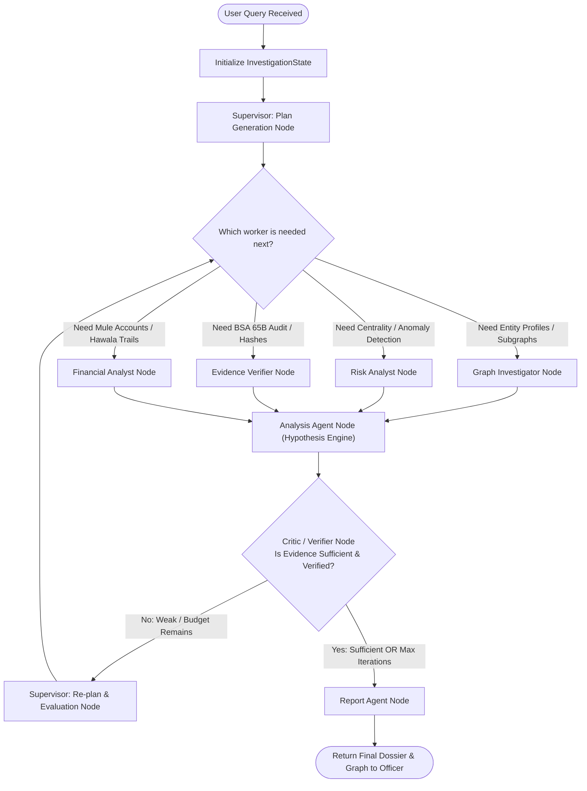

# 🧭 Agent Specification: Supervisor Agent (Orchestrator & Planner)

> **File Location:** [`backend/app/agents/nodes/supervisor.py`](../nodes/supervisor.py)  
> **Role:** Chief Intelligence Officer, Case Planner & Dispatcher  
> **Status:** Phase 2 Sprint Target

---

## 🎯 1. Mission & Investigative Purpose

When an investigating officer enters an unstructured, high-level intelligence query like:
> *"Rahul Sharma was arrested with 3 phones in FIR-102. Uncover his key associates, trace if he acts as a financial conduit or communication broker, and check if his CDR logs show burner phone bursts."*

A standard single-prompt LLM will hallucinate facts, fail to systematically explore multi-hop connections, and exceed token limits.

The **Supervisor Agent** acts as the senior investigating superintendent. It does NOT make low-level Neo4j database queries itself. Instead, it:
1. **Deconstructs the Officer's Query**: Extracts the subject entities, target crimes, and temporal parameters.
2. **Formulates an Investigation Plan**: Breaks the case into a structured 3–5 step plan.
3. **Dispatches Work**: Routes the case to specialized worker nodes (`graph_investigator`, `risk_analyst`, `evidence_verifier`, `financial_analyst`).
4. **Evaluates Progress & Re-plans**: Reads discoveries accumulated on the blackboard, adjusts plans if the Critic/Verifier requests deeper evidence, and routes between stages until evidentiary sufficiency is met.

---

## 📐 2. Architecture & Decision Flow



---

## 📥 3. State Interface & Schema Mutation

The Supervisor Agent reads and updates the shared [`InvestigationState`](../state.py):

### State Inputs:
- `user_query`: The raw natural language investigation prompt.
- `discovered_entities`: Accumulating list of discovered suspects, vehicles, phones.
- `discovered_relationships`: Accumulating edges discovered by workers.
- `hypotheses`: Working theories with statuses (`SUPPORTED`, `WEAK`, `REJECTED`).
- `iteration`: Integer counter tracking investigation depth.

### State Outputs / Mutations:
- `subject_entity_id`: Disambiguated primary target (e.g. `'P001'`).
- `investigation_plan`: Ordered list of actionable steps.
  ```json
  [
    "Step 1: Explore 2-hop graph perimeter around Rahul to identify direct phone and vehicle assets.",
    "Step 2: Run algorithmic centrality and circular transaction checks with Risk Analyst.",
    "Step 3: Retrieve source FIR citations and verify SHA-256 hash integrity with Evidence Verifier.",
    "Step 4: Synthesize final criminal profile and syndicate classification."
  ]
  ```
- `current_step`: Updated identifier of the worker agent currently being dispatched.
- `final_answer`: Markdown dossier containing executive findings, threat assessment, and evidence citations.

---

## 🧠 4. Prompt Engineering Strategy

The Supervisor uses a dual-prompt strategy:

### Phase A: Strategic Planning Prompt
```text
System: You are the Chief Intelligence Supervisor of the Nexxus Criminal Network Analysis Task Force.
Given the investigating officer's query, your objective is to:
1. Identify the primary subject entity (Name, ID, Phone, or Registration).
2. Deconstruct the request into an optimal 3-5 step investigation plan.
3. Formulate 1-2 initial hypotheses to test.
Assign the first specialized agent to dispatch: [graph_investigator | risk_analyst | evidence_verifier].
```

### Phase B: Evaluation & Routing Prompt
```text
System: You are evaluating ongoing intelligence discoveries for the case.
Review the accumulated discoveries, risk metrics, and evidence items.
Decide:
1. Is the investigation complete and ready for final synthesis? -> Return 'COMPLETE'
2. Or is further worker exploration needed? -> Return the next agent name: [graph_investigator | risk_analyst | evidence_verifier | financial_analyst].
```

---

## 🛡️ 5. Guardrails & Failure Modes

| Potential Failure | Root Cause | Supervisor Guardrail |
| :--- | :--- | :--- |
| **Infinite Delegation Loop** | Agents repeatedly re-querying the same node | Hard termination when `state["iteration"] >= 10`. Forces final synthesis. |
| **Subject Ambiguity** | Common names (e.g., multiple "Rahul"s) | Queries `search_entities` first to disambiguate target before launching deep subgraph scans. |
| **Hallucinated Conspiracies** | LLM asserting connections not in the graph | Supervisor requires every claim in the final briefing to reference a valid `evidence_items` doc ID. |
