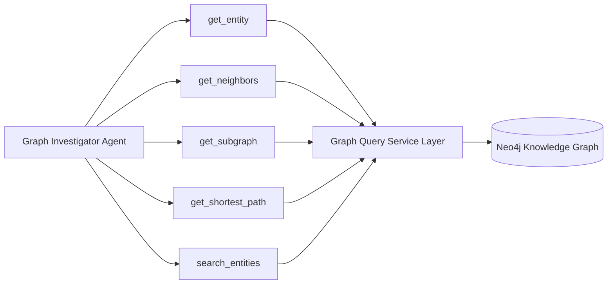

# 🕸️ Agent Specification: Graph Investigator Agent

> **File Location:** [`backend/app/agents/nodes/graph_investigator.py`](../nodes/graph_investigator.py)  
> **Tool Boundary:** [`backend/app/agents/tools/graph_tools.py`](../tools/graph_tools.py)  
> **Role:** Neo4j Knowledge Graph Traversal & Topology Specialist  
> **Status:** Phase 3 Sprint Target (Tool contracts completed in Phase 1)

---

## 🎯 1. Mission & Investigative Purpose

In complex organized crime syndicates, kingpins deliberately distance themselves from street-level crimes by using **proxy phone numbers**, **cloned license plates**, and **multi-layered front shell organizations**.

The **Graph Investigator Agent** is the field explorer of the knowledge graph. When assigned a task by the Supervisor, it:
1. Resolves suspect names, vehicle numbers, or phones to unambiguous Neo4j node IDs.
2. Traverses 1-hop and multi-hop relationships to reveal immediate criminal perimeters.
3. Traces shortest relational paths (communication bridges or ownership chains) between two seemingly unrelated suspects.
4. Identifies co-location patterns (suspects present at identical cell towers or safehouses).
5. Populates the `discovered_entities` and `discovered_relationships` blackboard in `InvestigationState`.

---

## 🛠️ 2. Tool Binding Matrix

The Graph Investigator is equipped exclusively with the 5 tools exported in [`GRAPH_TOOLS`](../tools/graph_tools.py):



| Tool | Parameters | Why It's Needed & Safeguards |
| :--- | :--- | :--- |
| **`search_entities`** | `query: str`, `limit: int = 10` (max 25) | Translates vague officer queries (e.g. *"Check phone ending in 9123"* or *"Find Rahul"*) into concrete entity IDs. |
| **`get_entity`** | `entity_id: str` | Pulls complete suspect attributes: Aadhaar, PAN, aliases, father's name, registered vehicles, and phone IDs. |
| **`get_neighbors`** | `entity_id: str` | Scans the immediate 1-hop perimeter to detect direct associates, owned vehicles, and burner phones. |
| **`get_subgraph`** | `entity_id: str`, `depth: int = 2` | Uncovers the broader local criminal cell. **Strictly bounded to depth $\le 3$** to prevent combinatorial explosion on dense graphs. |
| **`get_shortest_path`** | `source_id: str`, `target_id: str` | Proves direct or indirect links between a suspect and a victim, money mule, or shell company. |

---

## 📥 3. State Accumulation Contract

When the Graph Investigator completes a step, it updates [`InvestigationState`](../state.py):

```python
# Discovered nodes are appended (deduplicated by id)
discovered_entities.append({
    "id": "PH002",
    "type": "Phone",
    "number": "+919123456789",
    "carrier": "Airtel",
    "discovered_via": "OWNS_PHONE link from P001"
})

# Discovered relationships are appended
discovered_relationships.append({
    "source": "P001",
    "target": "ORG003",
    "type": "MEMBER_OF",
    "role": "Director"
})
```

---

## 🛡️ 4. The Depth-Bounding Safeguard (Why Depth $\le 3$ Matters)

In graph theory, traversing multi-hop networks follows $O(b^d)$ expansion, where $b$ is average node branching factor and $d$ is depth:
- Depth 1: $\sim 10$ nodes (direct contacts)
- Depth 2: $\sim 100$ nodes (friends of friends)
- Depth 3: $\sim 1,000$ nodes (dense criminal cell)
- Depth 4+: $\ge 10,000$ nodes (database locks, context window blowout)

Our tool boundary strictly enforces `bounded_depth = max(1, min(depth, 3))` in [graph_tools.py](../tools/graph_tools.py) so no LLM prompt can inadvertently trigger an unconstrained graph traversal.

---

## 🚨 5. Real-World Criminal Scenario Handled

### Scenario: Cloned License Plate & Proxy SIM Operation
1. Investigator searches for vehicle plate `"DL01AB1234"`.
2. Agent calls `search_entities("DL01AB1234")` and retrieves vehicle node `V001`.
3. Agent calls `get_neighbors("V001")`, discovering it is linked to two separate suspects: `P001` (Rahul) and `P009` (Vikram) in different cities.
4. Agent calls `get_shortest_path("P001", "P009")`, finding they both transacted with a known forged documents syndicate (`ORG005`).
5. Agent returns the complete chain of custody and subgraph to the Supervisor.
