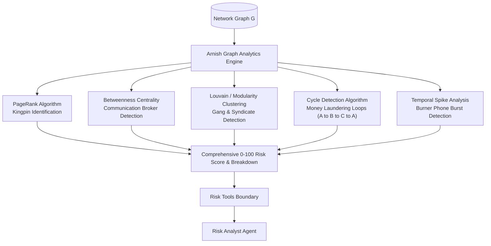

# 📊 Agent Specification: Risk Analyst Agent

> **File Location:** [`backend/app/agents/nodes/risk_analyst.py`](../nodes/risk_analyst.py)  
> **Tool Boundary:** [`backend/app/agents/tools/risk_tools.py`](../tools/risk_tools.py)  
> **Analytics Engine:** [`backend/app/analytics/`](../../analytics/) (Arnish's Engine)  
> **Role:** Mathematical Profiler, Centrality Specialist & Forensic Pattern Detective  
> **Status:** Phase 3 Sprint Target (Tool contracts completed in Phase 1)

---

## 🎯 1. Mission & Investigative Purpose

Human investigators cannot manually calculate graph-theoretic metrics across thousands of nodes to answer questions like:
- *"Who is the true kingpin directing operations from behind the scenes?"*
- *"Which broker node bridges communications between two violent criminal factions?"*
- *"Are these financial transfers a circular money laundering loop?"*

The **Risk Analyst Agent** acts as the computational behavioral profiler. Powered by Arnish's Graph Analytics Engine, it translates raw network topology into quantitative threat scores, identifies operational cliques, and detects criminal transaction signatures.

---

## 📐 2. Mathematical Foundation & Graph Algorithms



### The 6 Core Mathematical Sub-Scores
1. **Degree Centrality**: Immediate volume of incoming and outgoing calls, transactions, and ownership links.
2. **PageRank Score**: Measures indirect influence. High scores highlight kingpins whose orders flow down to lower-level operatives.
3. **Betweenness Centrality (Bridge Score)**: Identifies chokepoints and brokers. Suspects with high betweenness control the flow of communication or contraband between otherwise isolated criminal cells.
4. **Call Frequency Burst Score**: Identifies burner phone activity (telecommunication spikes $\ge 10$ calls/day around crime incident dates).
5. **Cross-Case Score**: Detects multi-jurisdictional repeat offenders appearing across multiple separate FIRs.
6. **Financial Anomaly Score**: Flags accounts engaged in circular transactions, rapid layering, or mule account pass-throughs.

---

## 🛠️ 3. Tool Binding Matrix

Equipped with the 4 tools exported in [`RISK_TOOLS`](../tools/risk_tools.py):

| Tool | Input Parameters | What It Evaluates |
| :--- | :--- | :--- |
| **`get_risk_score`** | `entity_id: str` | Returns normalized overall score (0.0 to 100.0), risk category (`HIGH`, `MEDIUM`, `LOW`), full 6-score breakdown, and behavioral tags. |
| **`get_network_centrality`** | `top_n: int = 5`, `metric: Literal["pagerank", "betweenness", "all"]` | Ranks network members to uncover the top kingpins and top communication brokers. |
| **`get_communities`** | `entity_id: Optional[str] = None` | Partitions network into criminal gangs/syndicates; reveals all co-members of a suspect's cluster. |
| **`detect_anomalies`** | `anomaly_type: Literal["circular_transactions", "call_bursts", "cross_case", "all"]` | Forensic scan for round-tripping money laundering loops and intense burner phone spikes. |

---

## 📥 4. State Interface: `risk_analysis`

The Risk Analyst populates the `risk_analysis` dictionary inside [`InvestigationState`](../state.py):

```python
{
    "target_risk": {
        "entity_id": "P001",
        "name": "Rahul Sharma",
        "overall_risk_score": 96.4,
        "risk_level": "HIGH",
        "risk_breakdown": {
            "degree_centrality": 100.0,
            "pagerank_score": 34.3,
            "betweenness_centrality": 100.0,
            "call_frequency_score": 99.3,
            "cross_case_score": 100.0,
            "financial_anomaly_score": 99.3
        },
        "tags": ["High Risk", "Key Broker", "Burner Phone User", "Money Laundering Loop"]
    },
    "network_context": {
        "top_broker": "Rahul Sharma (Betweenness: 0.0667)",
        "syndicate_cluster": "Syndicate_0",
        "syndicate_size": 2,
        "anomalies_flagged": ["Circular Transaction: Loop detected of length 3"]
    }
}
```

---

## 🛡️ 5. Resilient Fallback Architecture

To ensure multi-agent tests and demos remain bulletproof even if live database containers are restarting, [risk_tools.py](../tools/risk_tools.py) implements `safe_load_graph()`:
- Attempts to query live Neo4j database first.
- If unreachable, automatically falls back to Arnish's synthetic ground-truth graph (`ground_truth_case.json` / `mock_graph.py`).
- Guarantees zero unhandled crashes during investigative inference.
