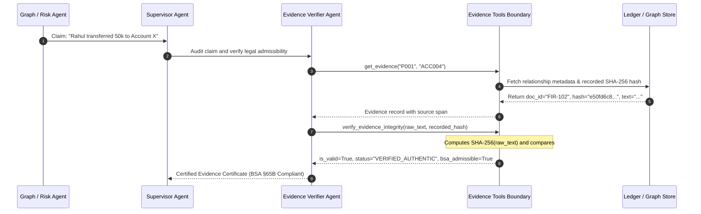

# ⚖️ Agent Specification: Evidence Verifier Agent

> **File Location:** [`backend/app/agents/nodes/evidence_verifier.py`](file:///c:/Users/biswa/Desktop/nexxus-db/backend/app/agents/nodes/evidence_verifier.py)  
> **Tool Boundary:** [`backend/app/agents/tools/evidence_tools.py`](file:///c:/Users/biswa/Desktop/nexxus-db/backend/app/agents/tools/evidence_tools.py)  
> **Legal Compliance:** Section 65B of Bharatiya Sakshya Adhiniyam (BSA), 2023  
> **Role:** Forensic Auditor, Chain-of-Custody Officer & Legal Admissibility Certifier  
> **Status:** Phase 3 Sprint Target (Tool contracts completed in Phase 1)

---

## 🎯 1. Mission & Investigative Purpose

In criminal justice proceedings, an AI system saying *"Rahul is connected to Vikram"* is legally useless without strict documentary proof. Under Indian Law:
- Electronic evidence (CDRs, transcripts, bank statements) **must satisfy Section 65B of the Bharatiya Sakshya Adhiniyam, 2023** (formerly Indian Evidence Act §65B).
- Digital records must demonstrate an unbroken **Chain of Custody** proving they were not altered, fabricated, or contaminated during investigation.

The **Evidence Verifier Agent** is the legal auditor of the digital police department. It ensures:
1. Every claim made by the Graph Investigator or Risk Analyst is backed by an actual FIR document citation, CDR log, or bank ledger row.
2. Every document excerpt is cryptographically verified against its recorded **SHA-256 hash** to detect tampering.
3. Every validated discovery is logged into `evidence_items` and certified in `verification_results` for court submission.

---

## 🔐 2. Cryptographic Verification & BSA §65B Pipeline



---

## 🛠️ 3. Tool Binding Matrix

Equipped with the 3 tools exported in [`EVIDENCE_TOOLS`](file:///c:/Users/biswa/Desktop/nexxus-db/backend/app/agents/tools/evidence_tools.py):

| Tool | Parameters | Function & Verification Standard |
| :--- | :--- | :--- |
| **`get_evidence`** | `entity_id1: str`, `entity_id2: str` | Retrieves provenance data linking two entities: FIR numbers, CDR log files, confidence ratings ($0.0$–$1.0$), and raw text excerpts. |
| **`verify_evidence_integrity`** | `raw_content: str`, `expected_hash: str` | Recomputes SHA-256 over raw text and checks for exact cryptographic equivalence. Flags `TAMPER_DETECTED` if even a single comma or digit was altered. |
| **`generate_evidence_hash`** | `content: str` | Computes an immutable SHA-256 hash for newly created investigator notes, hypothesis proofs, or extracted text spans. |

---

## 📥 4. State Interface: Evidence & Verification Records

Updates two critical collections in [`InvestigationState`](file:///c:/Users/biswa/Desktop/nexxus-db/backend/app/agents/state.py):

### A. `evidence_items` (Documentary Proof)
```json
[
  {
    "evidence_id": "EV-001",
    "relationship": "CALLED",
    "source_doc_id": "CDR_AIRTEL_AUGUST_2026",
    "confidence": 0.95,
    "timestamp": "2026-08-15T10:00:00Z",
    "evidence_hash": "e50fd6c8e82aad0d3b8b84f8af10c39c4210d3747d06f02d97b9456ceb617dea",
    "source_excerpt": "Subscriber +919123456789 connected with +919876543210 on Tower 4B for 340 seconds."
  }
]
```

### B. `verification_results` (BSA §65B Admissibility Certificates)
```json
[
  {
    "evidence_id": "EV-001",
    "algorithm": "SHA-256",
    "integrity_status": "VERIFIED_AUTHENTIC",
    "bsa_65b_admissible": true,
    "computed_hash": "e50fd6c8e82aad0d3b8b84f8af10c39c4210d3747d06f02d97b9456ceb617dea",
    "expected_hash": "e50fd6c8e82aad0d3b8b84f8af10c39c4210d3747d06f02d97b9456ceb617dea",
    "audit_timestamp": "2026-09-06T07:30:00Z",
    "audit_message": "Cryptographic check PASSED: Evidence content is untampered and certified under BSA §65B."
  }
]
```

---

## ⚖️ 5. Zero-Hallucination Court Guarantee

If an LLM worker suggests an investigative hypothesis that lacks a matching citation in the knowledge graph:
1. `get_evidence()` returns `evidence_found = False`.
2. The Evidence Verifier marks the hypothesis status as **`REJECTED`** or **`WEAK`**.
3. The Supervisor is forced to state in the final report that the claim is an unsubstantiated lead, preventing false accusations in court.
