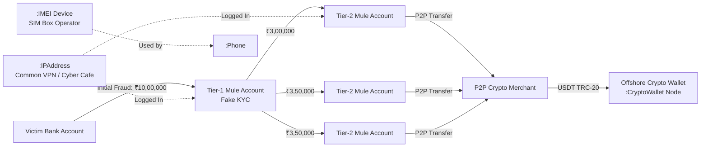

# 💰 Agent Specification: Financial & Cyber Forensics Agent

> **File Location:** [`backend/app/agents/nodes/financial_analyst.py`](../nodes/financial_analyst.py)  
> **Specialization:** Mule Account Networks, Smurfing, Hawala Trails & Crypto Cash-Outs  
> **Target Graph Labels:** `:CryptoWallet`, `:IPAddress`, `:IMEI`, `:Transaction`  
> **Status:** Phase 3 Sprint Target

---

## 🎯 1. Mission & Investigative Purpose

In cyber-enabled financial fraud, extortion, and cyber scam operations (e.g. digital arrest scams, task-based investment fraud, illegal betting apps):
- Criminals **never** withdraw stolen money directly into personal accounts.
- Funds are instantly dispersed through hundreds of rented **mule bank accounts** (smurfing/layering) within minutes.
- The terminal cash-out occurs via peer-to-peer (P2P) crypto purchases (USDT/TRC-20, Bitcoin) or offshore hawala brokers.

The **Financial & Cyber Forensics Agent** is the forensic accountant of the multi-agent task force. It specializes in:
1. Reconstructing rapid fund dispersal chains from victim debit to crypto cash-out.
2. Detecting mule account signatures (accounts opened with forged Aadhaar/PAN receiving high-velocity deposits followed by immediate ATM or crypto conversions).
3. Correlating telecommunication hardware (`:IMEI`, SIM boxes) and network endpoints (`:IPAddress`) with financial transaction nodes.

---

## ⛓️ 2. The Financial Laundering & Cyber Graph Flow



---

## 🔍 3. Forensic Detection Capabilities

### A. Smurfing & Structuring Detection
Detects multiple transactions placed just below mandatory regulatory reporting thresholds (e.g. repeated ₹49,500 transfers to evade ₹50,000 PAN tracking in India).

### B. Circular Transaction Round-Tripping (A to B to C to A)
Invokes `detect_anomalies("circular_transactions")` from Arnish's engine to identify layering networks where money circulates through shell companies to create fictitious business turnover before returning to the kingpin.

### C. Cyber Footprint Correlation
Correlates `:IPAddress` and `:IMEI` nodes:
- If 15 different mule accounts and 10 phone numbers log into net banking from the exact same `:IPAddress` or use the same `:IMEI` device, they are confirmed to be part of a single **SIM box / cyber syndicate**.

---

## 📥 4. State Interface Integration

The Financial & Cyber Analyst writes directly to [`InvestigationState`](../state.py):

```python
{
    "financial_trail": {
        "source_account": "ACC_VICTIM_401",
        "total_disbursed": 1000000.0,
        "mule_hops": [
            {"tier": 1, "account": "ACC_MULE_101", "amount": 1000000.0, "time_delta_seconds": 120},
            {"tier": 2, "account": "ACC_MULE_102", "amount": 350000.0, "time_delta_seconds": 340}
        ],
        "crypto_cashouts": [
            {
                "exchange": "Binance P2P",
                "wallet_address": "TQzV8F...trc20",
                "amount_usdt": 11500.0,
                "confidence": 0.92
            }
        ],
        "correlated_hardware": {
            "common_imei": "864201048891234",
            "sim_box_suspected": True
        }
    }
}
```

---

## 🎯 5. Hackathon Defense Value (SIH26189)

Presenting this agent in your Smart India Hackathon jury defense demonstrates:
1. **Real-world alignment with modern Indian cybercrime trends** (Digital arrest, fake trading apps, Chinese loan scam mules).
2. **Multi-domain correlation**: Seamlessly fusing Neo4j graph data across banking, telecommunication, and blockchain layers.
3. **Actionable Police Output**: Generates immediate bank freeze requests (`Section 91 CrPC / Section 94 BNSS`) for active mule accounts.
