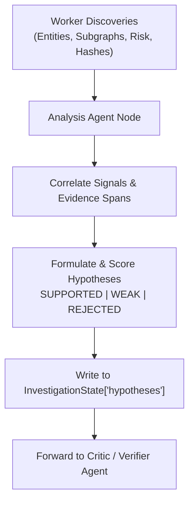

# 🔬 Agent Specification: Analysis Agent (Hypothesis Engine)

> **File Location:** [`backend/app/agents/nodes/analysis_agent.py`](../nodes/analysis_agent.py)  
> **Role:** Cross-Correlator, Pattern Recognition & Hypothesis Formulator  
> **Status:** Phase 4 Sprint Target  

---

## 🎯 1. Mission & Investigative Purpose

While worker agents retrieve raw facts (subgraphs, risk scores, BSA §65B document excerpts), the **Analysis Agent** is responsible for synthesis. It correlates disconnected signals to evaluate and update investigative hypotheses:
- **Bridge Suspect Detection**: Identifying if a subject acts as a cut-out or connector between distinct criminal syndicates.
- **Burner Phone & Asset Correlation**: Detecting whether multiple burner SIMs belong to the same operator based on co-location and temporal call patterns.
- **Financial Funneling**: Detecting circular fund movements linking front organizations back to a mastermind.

---

## 📐 2. Architecture & Decision Flow



---

## 📥 3. State Interface & Schema Mutation

### State Inputs:
- `discovered_entities`: Node records discovered by Graph & Risk workers.
- `discovered_relationships`: Traversed edges and call/transaction records.
- `risk_analysis`: Centrality metrics, PageRank scores, and anomaly flags.
- `evidence_items`: Document excerpts and certified source text.
- `hypotheses`: Prior hypotheses generated during supervisor planning.

### State Outputs:
- `hypotheses`: Updated list of structured `Hypothesis` items:
  ```json
  {
    "id": "H-001",
    "claim": "Rahul Sharma acts as an active communication broker between Syndicate A and Syndicate B.",
    "status": "SUPPORTED",
    "rationale": "High betweenness centrality (0.82) combined with 47 recorded calls across both cluster IDs.",
    "supported_evidence_id": ["FIR-102", "CDR-2024-03"]
  }
  ```

---

## 🛡️ 4. Guardrails

1. **No Unsupported Speculation**: Every claim promoted to `SUPPORTED` must explicitly link at least 1 valid `supported_evidence_id`.
2. **Deterministic Confidence Calculation**: Uses reproducible scoring thresholds rather than arbitrary LLM confidence scores.
