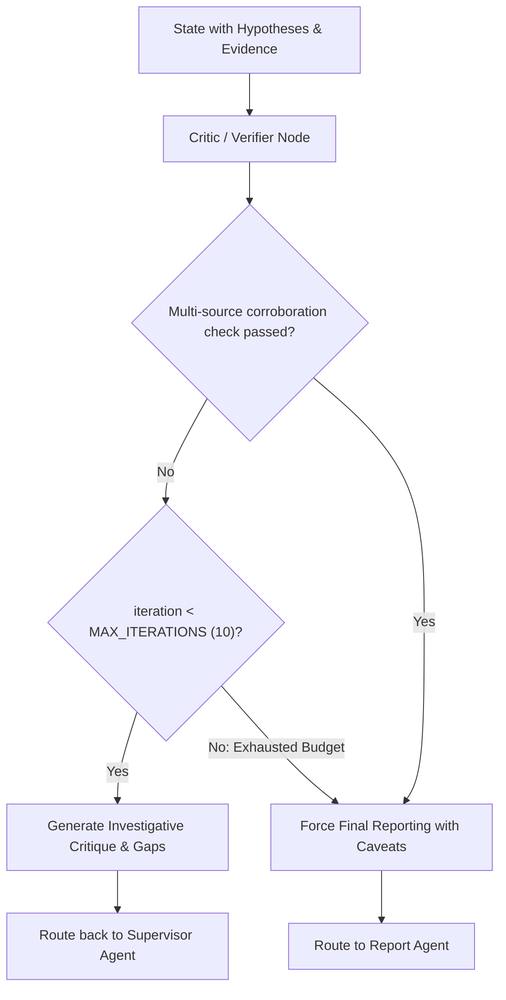

# 🕵️‍♀️ Agent Specification: Critic / Verifier Agent (Quality Gatekeeper & Loop Controller)

> **File Location:** [`backend/app/agents/nodes/critic_verifier.py`](../nodes/critic_verifier.py)  
> **Role:** Independent Evidence Auditor, Devil's Advocate & Re-planning Loop Decider  
> **Status:** Phase 5 Sprint Target  

---

## 🎯 1. Mission & Investigative Purpose

In automated intelligence pipelines, models suffer from confirmation bias—prematurely declaring a case solved on superficial correlations. 

The **Critic / Verifier Agent** acts as the internal affairs quality auditor. It does NOT search the graph; it rigorously scrutinizes findings against legal and evidentiary standards before permitting dossier compilation:
1. **Evidentiary Corroboration**: Checks if key findings rely on single-source hearsay or are backed by multiple independent nodes (e.g. CDR calls corroborating financial transfers).
2. **BSA §65B Cryptographic Provenance**: Confirms all cited text excerpts have verified SHA-256 signatures matching the custody ledger.
3. **Loop Termination vs. Re-planning**:
   - If findings are weak or unverified and `iteration < MAX_ITERATIONS (10)`: Directs the workflow back to the **Supervisor Agent** with an itemized critique to formulate a targeted re-plan.
   - If findings are sufficiently corroborated or iteration limit is reached: Approves graduation to the **Report Agent**.

---

## 📐 2. Architecture & Decision Flow

---

## 📥 3. State Interface & Schema Mutation

### State Inputs:
- `hypotheses`: Structured hypothesis statuses (`SUPPORTED`, `WEAK`, `REJECTED`).
- `evidence_items`: Extracted citations and SHA-256 hashes.
- `verification_results`: Cryptographic verification certificates.
- `iteration`: Current iteration count.

### State Outputs / Routing Decision:
- `verification_results`: Appends critique logs, confidence audits, and corroboration gap notices.
- Return edge: `"supervisor"` (if gaps identified and budget remains) or `"report_agent"`.

---

## 🛡️ 4. Guardrails

1. **Strict Loop Bound (`MAX_ITERATIONS = 10`)**: Prevents infinite critique-replan loops.
2. **Hard Audit Trail**: Every decision to reject or approve findings is logged in `verification_results`.
