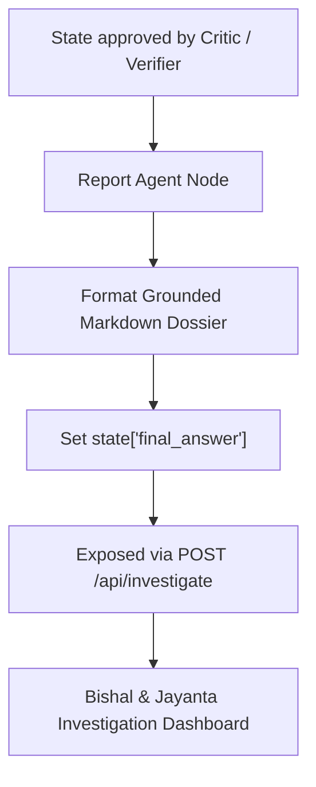

# 📝 Agent Specification: Report Agent (Dossier Compiler & API)

> **File Location:** [`backend/app/agents/nodes/report_agent.py`](../nodes/report_agent.py)  
> **Role:** Dossier Formatter, Timeline Synthesizer & Presentation Engine  
> **Status:** Phase 6 Sprint Target  

---

## 🎯 1. Mission & Investigative Purpose

The **Report Agent** transforms accumulated state discoveries (subgraphs, PageRank metrics, transaction chains, and verified evidence excerpts) into a polished, court-ready, and command-level criminal intelligence dossier.

It does NOT make decisions or explore paths. It reads verified findings approved by the **Critic / Verifier Agent** and formats:
1. **Executive Threat Assessment**: High-level synopsis of the suspect's criminal posture and syndicate role (Kingpin, Broker, Mule, Operative).
2. **Network Topology & Asset Breakdown**: Tabular and structural inventory of connected vehicles, burner phones, organizations, and co-accused.
3. **Hypotheses Verdicts**: Clear statements of evaluated theories with supporting evidence citations.
4. **BSA §65B Evidentiary Manifest**: Tamper-proof table containing document IDs, excerpt hashes, and cryptographic certification status.
5. **Actionable Law-Enforcement Next Steps**: Immediate investigative actions (e.g., *“Freeze Account X”, “Issue Lookout Circular (LOC) for Vehicle Y”*).

---

## 📐 2. Architecture & Delivery

---

## 📥 3. State Interface & Schema Mutation

### State Inputs:
- `user_query`: Original query for contextual framing.
- `subject_entity_id`: Disambiguated subject identifier.
- `discovered_entities`: Full list of verified suspects, vehicles, phones.
- `discovered_relationships`: Edges mapped in the subgraph.
- `risk_analysis`: Centrality metrics and anomaly scores.
- `evidence_items`: Certified text citations.
- `hypotheses`: Final evaluated hypotheses.
- `verification_results`: BSA §65B audit entries.

### State Outputs:
- `final_answer`: Complete grounded Markdown dossier string.
- `current_step`: `"COMPLETED"`.
