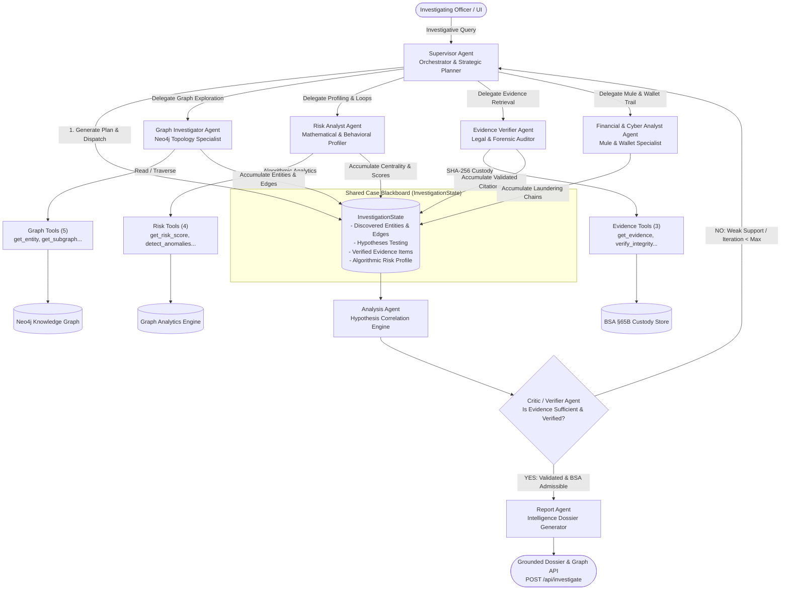

# 🕵️‍♂️ Nexxus DB: Multi-Agent Criminal Investigation Platform
## Architecture, Agent Specifications & Lifecycle Directory

> **Smart India Hackathon (SIH 2026) — Problem Statement SIH26189**  
> *AI-Powered Criminal Network Analysis & Knowledge Graph System*

---

## 📌 1. Executive Summary & The Need for Multi-Agent Systems

Criminal networks do not operate as isolated records in a database. Modern syndicates distribute their operations across:
- **Burner Telecommunications**: Multiple SIM cards registered under fake Aadhaar credentials, frequent IMEI rotation.
- **Layered Financial Trails**: Circular transactions through mule bank accounts and hawala/crypto conversions.
- **Complex Organizational Hierarchies**: Legitimate shell front companies hiding underlying conspirators.
- **Cross-Jurisdictional FIRs**: Separate police stations filing incidents without realizing the same kingpin is behind them.

A monolithic LLM prompt fails on these problems due to **hallucinations**, **context window overflow**, and **lack of auditability**. The **Nexxus DB Multi-Agent Engine** solves this by deploying **LangGraph-driven specialized agents** acting as an autonomous digital police task force.

Each agent has a strictly bounded role, a defined tool contract, and communicates via a shared blackboard case file: [`InvestigationState`](../state.py).

---

## 🏛️ 2. System Architecture & Topology



---

## 📑 3. Agent Catalog & Documentation Index

| # | Agent Name | Primary Responsibility | Key Tools / Nodes | Detailed Spec Doc |
| :-: | :--- | :--- | :--- | :--- |
| **01** | **Supervisor Agent** | Deconstructs queries, extracts subjects, generates 3–5 step plans, dynamically delegates to workers, and manages iteration guardrails. | Plan & Route Dispatcher | [01_SUPERVISOR_AGENT.md](./01_SUPERVISOR_AGENT.md) |
| **02** | **Graph Investigator Agent** | Discovers hidden associates, multi-hop shell connections, burner phone ownership, and shortest paths. | `get_entity`, `get_neighbors`, `get_subgraph`, `get_shortest_path`, `search_entities` | [02_GRAPH_INVESTIGATOR.md](./02_GRAPH_INVESTIGATOR.md) |
| **03** | **Risk Analyst Agent** | Profiles threat levels using PageRank (kingpins), Betweenness (brokers), circular transactions (money laundering), and call bursts. | `get_risk_score`, `get_network_centrality`, `get_communities`, `detect_anomalies` | [03_RISK_ANALYST.md](./03_RISK_ANALYST.md) |
| **04** | **Evidence Verifier Agent** | Ensures court admissibility under Bharatiya Sakshya Adhiniyam (BSA) §65B, audits cryptographic SHA-256 hashes, and certifies tamper-free provenance. | `get_evidence`, `verify_evidence_integrity`, `generate_evidence_hash` | [04_EVIDENCE_VERIFIER.md](./04_EVIDENCE_VERIFIER.md) |
| **05** | **Financial & Cyber Analyst Agent** | Traces shell accounts, high-frequency UPI/NEFT laundering, crypto-wallets (USDT/BTC), and correlates SIM boxes / IMEI fraud. | Financial sub-queries, cyber endpoints | [05_FINANCIAL_CRYPTO_ANALYST.md](./05_FINANCIAL_CRYPTO_ANALYST.md) |
| **06** | **Analysis Agent** | Synthesizes and cross-correlates multi-source evidence (topology + risk + financial) to formulate and test structured hypotheses (`SUPPORTED`, `WEAK`, `REJECTED`). | Hypothesis Engine | [06_ANALYSIS_AGENT.md](./06_ANALYSIS_AGENT.md) |
| **07** | **Critic / Verifier Agent** | Serves as independent forensic gatekeeper: checks for single-source bias, validates evidence confidence thresholds, verifies hash provenance, and triggers re-planning loop. | Quality & Loop Controller | [07_CRITIC_VERIFIER.md](./07_CRITIC_VERIFIER.md) |
| **08** | **Report Agent** | Compiles grounded, court-admissible intelligence briefing with visual graph structures, timeline of crimes, and tactical recommendations for field officers. | Dossier Generator (`/api/investigate`) | [08_REPORT_AGENT.md](./08_REPORT_AGENT.md) |

---

## 🔄 4. The Shared Case Blackboard: `InvestigationState`

Defined in [`backend/app/agents/state.py`](../state.py):

```python
class InvestigationState(TypedDict):
    user_query: str                          # Original officer request
    subject_entity_id: Optional[str]         # Primary target (e.g. 'P001' / 'Rahul')
    investigation_plan: List[str]            # Strategic 3-5 step plan from Supervisor
    current_step: str                        # Currently executing step/agent
    discovered_entities: List[Dict[str, Any]]# Discovered suspects, vehicles, phones
    discovered_relationships: List[Dict]     # Discovered edges (calls, transactions)
    hypotheses: List[Hypothesis]             # Working investigative theories
    evidence_items: List[Dict[str, Any]]     # Verified FIR / CDR citations
    risk_analysis: Dict[str, Any]            # Centrality & threat metrics
    verification_results: List[Dict]         # BSA §65B cryptographic audit logs
    tool_history: List[ToolInvocation]       # Complete audit trail of tool invocations
    iteration: int                           # Safety loop-counter (max 10)
    final_answer: Optional[str]              # Final executive intelligence report
```

---

## 🛡️ 5. Key Safeguards & Security Principles

1. **Strict Query Bounding**:
   - Depth bounded to $\le 3$ hops to avoid exponential Cypher explosion on dense graphs.
   - Search entity results bounded to $\le 25$ records.
2. **Loop Breakers**:
   - `iteration` counter automatically halts execution at 10 cycles to eliminate infinite LLM agent loops.
3. **BSA §65B Cryptographic Admissibility**:
   - Every evidence excerpt presented to the investigator is verified against an immutable SHA-256 fingerprint.
4. **Resilient Graph Fallbacks**:
   - When live Neo4j containers are offline, tools automatically transition to safe synthetic analytical topologies, ensuring testing and demo stability.
